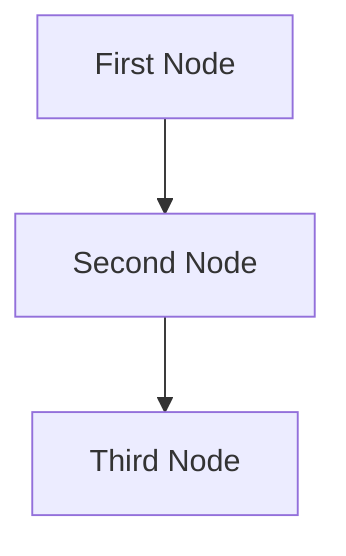

## When to Use

- Nuevo proyecto PocketFlow
- Documentar un nuevo flow o agente
- Antes de implementar código (Step 2 del Agentic Coding protocol)

## Template: docs/design.md

```markdown
# Design Doc: {Project Name}

> Please DON'T remove notes for AI

## Requirements

> Notes for AI: Keep it simple and clear.
> If the requirements are abstract, write concrete user stories

- 

## Flow Design

> Notes for AI:
> 1. Consider the design patterns of agent, map-reduce, rag, and workflow. Apply them if they fit.
> 2. Present a concise, high-level description of the workflow.

### Applicable Design Patterns

- **Workflow**: 
- **Agent**: 
- **RAG**: 
- **MapReduce**: 

### Flow high-level Design



1. **First Node**: 
   - 
2. **Second Node**: 
   - 
3. **Third Node**: 
   - 

## Utility Functions

> Notes for AI:
> 1. Understand the utility function definition thoroughly by reviewing the doc.
> 2. Include only the necessary utility functions, based on nodes in the flow.

1. **{Name}** (`utils/{name}.py`)
   - *Input*: 
   - *Output*: 
   - *Necessity*: 

2. **{Name}** (`utils/{name}.py`)
   - *Input*: 
   - *Output*: 
   - *Necessity*: 

## Node Design

### Shared Store

> Notes for AI: Try to minimize data redundancy

```python
shared = {
    "input": {},
    "results": {},
    "config": {}
}
```

### Node Steps

> Notes for AI: Carefully decide whether to use Batch/Async Node/Flow.

1. **{Node Name}**
   - *Purpose*: 
   - *Type*: Regular | Batch | Async
   - *Steps*:
     - *prep*: Read "" from the shared store
     - *exec*: Call 
     - *post*: Write "" to the shared store

2. **{Node Name}**
   - *Purpose*: 
   - *Type*: Regular | Batch | Async
   - *Steps*:
     - *prep*: Read "" from the shared store
     - *exec*: Call 
     - *post*: Write "" to the shared store
```

## How to Use

1. Copiar el template
2. Llenar **Requirements** primero (humano)
3. Diseñar el **Flow** con mermaid (humano + AI)
4. Definir **Utility Functions** necesarias
5. Diseñar cada **Node** (prep/exec/post)
6. Definir **Shared Store** estructura

## Example

Ver un ejemplo completo en la documentación oficial de PocketFlow:
https://github.com/the-pocket/PocketFlow/blob/main/docs/guide.md

## Resources

- **Main Skill**: Ver `pocketflow` skill para patrones completos
- **PocketFlow Docs**: https://github.com/the-pocket/PocketFlow
