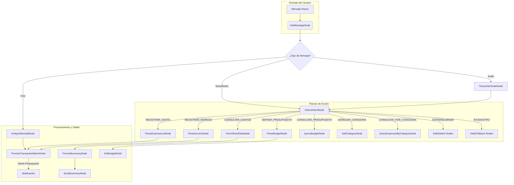

# 🤖 Bot de Finanzas Personales con IA (PocketFlow + Gemini)

Un bot inteligente y multimodal para Telegram que te ayuda a llevar un control de tus finanzas personales de manera sencilla y conversacional. Registra gastos e ingresos, consulta resúmenes, define presupuestos y recibe alertas.

Ahora con **Visión Computacional**: ¡Simplemente envía una foto de tu ticket y el bot hará el resto!

## ✨ Características Principales

*   ✅ **Registro de Transacciones:** Añade gastos e ingresos al instante.
*   📸 **Escaneo de Recibos (NUEVO):** Envía una foto de una factura, ticket o cuenta. La IA "leerá" la imagen, extraerá los ítems, el total y clasificará el gasto automáticamente.
*   🗣️ **Soporte Multimodal:** Envía mensajes de **texto** o **notas de voz** para registrar tus transacciones.
*   🧠 **Inteligencia Contextual:** Utiliza **Google Gemini 2.0 Flash** para entender lenguaje natural, jerga local, fechas relativas ("ayer", "el mes pasado") y analizar imágenes.
*   📊 **Resúmenes Financieros:** Pide reportes por períodos flexibles ("hoy", "últimos 15 días") y recibe análisis mensuales automáticos con insights sobre tus hábitos.
*   🎯 **Gestión de Presupuestos:** Define límites mensuales por categoría y recibe **alertas proactivas** si estás por excederte.
*   🔍 **Consultas Detalladas:** Pregunta por gastos específicos ("¿cuánto gasté en Uber este mes?").
*   ☁️ **Google Sheets:** Todo se guarda en tu hoja de cálculo personal, manteniendo tus datos seguros y accesibles.
*   🛠️ **Arquitectura Agéntica:** Construido sobre **PocketFlow**, con una separación clara entre lógica de flujo, nodos de ejecución y prompts de IA.

## ⚙️ ¿Cómo Funciona? (Arquitectura)

El proyecto utiliza el framework **PocketFlow**, organizando la lógica en **Nodos** independientes.

1.  **Recepción:** `GetMessageNode` detecta si el mensaje es Texto, Audio, Foto o un Botón.
2.  **Procesamiento de Entrada:**
    *   🎤 **Audio:** `TranscribeAudioNode` convierte voz a texto.
    *   📸 **Foto:** `AnalyzeReceiptNode` usa visión computacional para extraer datos del ticket.
    *   💬 **Texto:** Pasa directamente al detector de intención.
3.  **Cerebro (Router):** `DetectIntentNode` decide qué quiere hacer el usuario (registrar, consultar, editar, etc.) y deriva al nodo correspondiente.
4.  **Ejecución:** Los nodos específicos interactúan con Google Sheets o generan respuestas.
5.  **Prompts Desacoplados:** Toda la "personalidad" e instrucciones para la IA viven en `utils/prompts.py`, facilitando la iteración sin tocar el código.

### Diagrama del Flujo


```mermaid
flowchart TD
    subgraph "Entrada del Usuario"
        A[Mensaje Nuevo] --> B(GetMessageNode);
    end

    B --> C{¿Tipo de Mensaje?};
    C -- Texto/Botón --> E[DetectIntentNode];
    C -- Audio --> D[TranscribeAudioNode];
    C -- Foto --> Z[AnalyzeReceiptNode];
    
    D --> E;

    subgraph "Ramas de Acción"
        E -- REGISTRAR_GASTO --> F[ParseExpenseListNode];
        E -- REGISTRAR_INGRESO --> G[ParseIncomeNode];
        E -- CONSULTAR_GASTOS --> H[FetchSheetDataNode];
        E -- DEFINIR_PRESUPUESTO --> I[ParseBudgetNode];
        E -- CONSULTAR_PRESUPUESTO --> J[QueryBudgetNode];
        E -- AGREGAR_CATEGORIA --> Q[AddCategoryNode];
        E -- CONSULTAR_POR_CATEGORIA --> R[QueryExpensesByCategoryNode];
        E -- EDITAR/ELIMINAR --> U[Edit/Delete Nodes];
        E -- AYUDA/OTRO --> T[Help/Fallback Nodes];
    end

    subgraph "Procesamiento y Salida"
        Z --> K[ProcessTransactionBatchNode];
        F --> K;
        G --> K;
        K -- Alerta Presupuesto --> L[Notificación];
        H --> M[FormatSummaryNode] --> N[SendSummaryNode];
        I --> O[SetBudgetNode];
    end
```

## 📖 Guía de Uso y Ejemplos

#### 1. Escaneo de Recibos (📸 Nuevo)
Simplemente toma una foto a tu ticket de compra y envíala al chat. No hace falta escribir nada.

| Acción | Resultado |
| :--- | :--- |
| *[Envías una foto de un ticket de supermercado]* | `Gasto Registrado ✅`<br>`Monto: 15450.00 PESOS`<br>`Categoría: Alimentos`<br>`Descripción: Compra Supermercado` |

#### 2. Registrar Gastos (Texto o Voz)
Puedes registrar múltiples gastos en una sola frase.

| Comando | Respuesta |
| :--- | :--- |
| `Gaste 5000 en un cafe y 12000 en nafta` | `Gasto Registrado ✅ (Salidas)`<br>`Gasto Registrado ✅ (Auto)` |
| 🎙️ *"Cargué 20 mil de sube"* | `Gasto Registrado ✅`<br>`Monto: 20000.0 PESOS`<br>`Categoría: Transporte` |

#### 3. Consultas y Resúmenes

| Comando | Respuesta |
| :--- | :--- |
| `resumen de la semana pasada` | `📊 Resumen de Finanzas...`<br>`💸 Ingresos: $150,000`<br>`💰 Gastos: $45,000` |
| `cuanto gaste en pedidos ya este mes?` | `🔎 Detalle de Gastos para Delivery...` |

#### 4. Presupuestos y Alertas

| Comando | Respuesta |
| :--- | :--- |
| `fijar presupuesto de 100000 para salidas` | `✅ Presupuesto actualizado para Salidas.` |
| `como voy con salidas?` | `📊 Estado: 85% consumido. Te quedan $15,000.` |

*El bot te avisará automáticamente si un gasto hace que superes el 85% o el 100% de tu presupuesto.*

#### 5. Gestión y Edición

| Comando | Respuesta |
| :--- | :--- |
| `agrega la categoria Gimnasio` | `✅ Categoría 'Gimnasio' agregada.` |
| `el ultimo gasto no era 5000, eran 4500` | `✏️ Gasto actualizado con éxito.` |
| `borra el ultimo gasto` | `🗑️ Gasto eliminado.` |

## 🚀 Instalación y Configuración

### Prerrequisitos
*   Python 3.10 o superior.
*   Cuenta de Telegram y Token de Bot (@BotFather).
*   API Key de Google Gemini (Google AI Studio).
*   Cuenta de Google Cloud (para Google Sheets API).
*   `ffmpeg` instalado (para procesar audios de voz).

### Pasos

1.  **Clonar y Entorno Virtual:**
    ```bash
    git clone https://github.com/tu-usuario/tu-repo.git
    cd tu-repo
    python -m venv venv
    source venv/bin/activate  # Windows: venv\Scripts\activate
    ```

2.  **Instalar Dependencias:**
    ```bash
    pip install -r requirements.txt
    ```
    *Asegúrate de que `Pillow` y `google-generativeai` estén en el requirements.txt.*

3.  **Variables de Entorno (.env):**
    Crea un archivo `.env` en la raíz:
    ```env
    TELEGRAM_TOKEN="TU_TOKEN"
    GEMINI_API_KEY="TU_API_KEY"
    GOOGLE_SHEET_ID="ID_DE_TU_SHEET"
    ADMIN_CHAT_ID="TU_ID_DE_TELEGRAM" (Para reportes mensuales)
    ```

4.  **Google Sheets:**
    *   Obtén tu `service_account.json` de Google Cloud Console.
    *   Comparte tu hoja con el email del service account.
    *   Asegúrate de tener las hojas: `Gastos`, `Presupuestos`, `Categorias`.

5.  **Ejecutar:**
    ```bash
    python main.py
    ```

## 📂 Estructura del Proyecto

```
.
├── main.py                 # Entry point. Configura el Scheduler y el bucle principal.
├── flow.py                 # Definición del grafo de nodos (PocketFlow).
├── nodes.py                # Lógica de ejecución de cada nodo.
├── requirements.txt        # Dependencias (incluye Pillow, pocketflow, etc).
├── .env                    # Secretos.
├── service_account.json    # Credenciales Google.
├── Dockerfile              # Configuración para Docker.
├── fly.toml                # Configuración para despliegue en Fly.io.
└── utils/
    ├── __init__.py
    ├── call_llm.py         # Interacción con Gemini (Texto, Audio e Imágenes).
    ├── prompts.py          # 🧠 Todos los prompts del sistema centralizados.
    ├── gsheets_api.py      # Lectura/Escritura en Sheets.
    ├── telegram_api.py     # Polling y envío de mensajes/fotos.
    └── logger_config.py    # Configuración de logs.
```

## ☁️ Despliegue (Fly.io)

1.  Instala `flyctl` e inicia sesión.
2.  Genera la app: `fly launch` (no despliegues aún).
3.  Configura los secretos en la nube:
    ```bash
    fly secrets set TELEGRAM_TOKEN="..." GEMINI_API_KEY="..." GOOGLE_SHEET_ID="..."
    # Para el JSON de google:
    fly secrets set GCP_SERVICE_ACCOUNT_JSON='Contenido de tu json aqui'
    ```
    *(Nota: Deberás adaptar `gsheets_api.py` para leer el JSON desde una variable de entorno si usas este método de secretos para el archivo JSON).*
4.  Despliega: `fly deploy`.

---

**Disclaimer:** Este es un proyecto personal de código abierto. Úsalo bajo tu propia responsabilidad. ¡Cuida tus finanzas! 💸