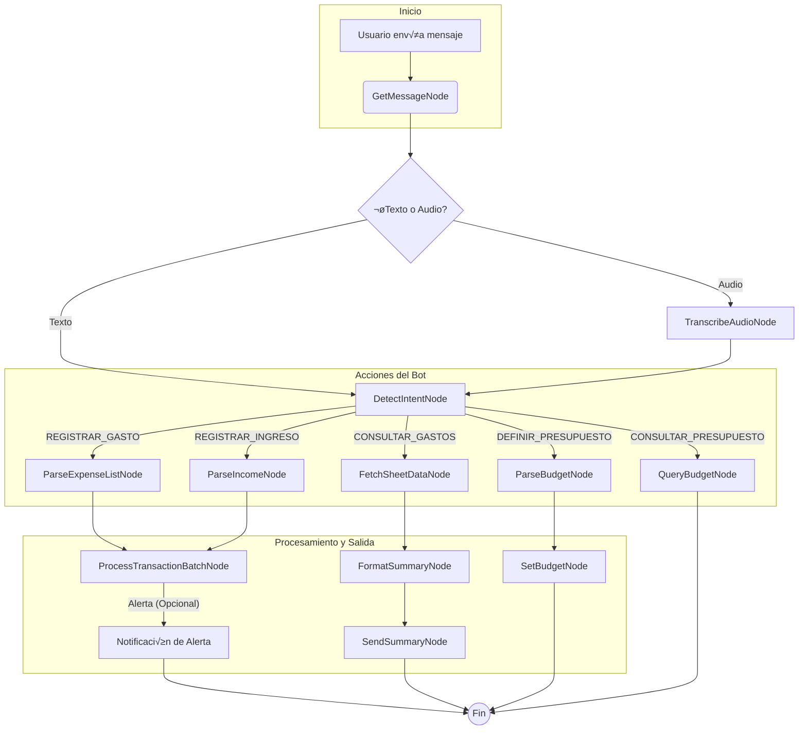

# Bot de Finanzas Personales para Telegram

Un bot inteligente y multimodal para Telegram que te ayuda a llevar un control de tus finanzas personales de manera sencilla y conversacional. Registra gastos e ingresos, consulta resúmenes, define presupuestos y recibe alertas, todo a través de mensajes de texto o voz.

## Características Principales

*   ✅ **Registro de Transacciones:** Añade gastos e ingresos al instante.
*   🗣️ **Soporte Multimodal:** Envía un mensaje de texto o un **mensaje de voz** para registrar tus transacciones.
*   📊 **Resúmenes Financieros:** Pide resúmenes por períodos específicos ("hoy", "ayer", "esta semana", "el mes de mayo").
*   🎯 **Gestión de Presupuestos:** Define presupuestos mensuales por categoría y consulta tu progreso en cualquier momento.
*   🔔 **Alertas Automáticas:** Recibe notificaciones proactivas si te acercas o superas tu presupuesto mensual en una categoría.
*   🧠 **Procesamiento con IA:** Utiliza Google Gemini para entender el lenguaje natural, extraer datos y clasificar la intención del usuario.
*   ☁️ **Integración con Google Sheets:** Todas tus transacciones y presupuestos se guardan de forma segura y accesible en tu propia hoja de cálculo.

## ¿Cómo Funciona? El Flujo del Bot

El proyecto está construido sobre el framework **PocketFlow**, que organiza la lógica en una serie de **Nodos** interconectados. Cada nodo tiene una tarea específica, lo que hace que el sistema sea modular y fácil de extender.

El flujo principal es el siguiente:

1.  **Recepción del Mensaje:** El `GetMessageNode` revisa constantemente si hay nuevos mensajes en Telegram.
2.  **An√°lisis de Tipo:** Determina si el mensaje es de texto o de audio.
    *   Si es **audio**, pasa al `TranscribeAudioNode`, que usa la IA para convertir la voz a texto.
    *   Si es **texto**, pasa directamente al siguiente paso.
3.  **Detección de Intención:** El `DetectIntentNode` analiza el texto (ya sea original o transcrito) y lo clasifica en una de las acciones posibles (registrar gasto, consultar resumen, definir presupuesto, etc.).
4.  **Ramificación (Branching):** Según la intención detectada, el flujo se dirige a la rama correspondiente para ejecutar la acción solicitada.
5.  **Ejecución y Respuesta:** Los nodos de cada rama procesan la solicitud, interactúan con Google Sheets y envían una respuesta al usuario a través de Telegram.

### Diagrama del Flujo


```mermaid
flowchart TD
    subgraph "Inicio"
        A[Usuario envía mensaje] --> B(GetMessageNode);
    end

    B --> C{¬øTexto o Audio?};
    C -- Texto --> E[DetectIntentNode];
    C -- Audio --> D[TranscribeAudioNode];
    D --> E;

    subgraph "Acciones del Bot"
        E -- REGISTRAR_GASTO --> F[ParseExpenseListNode];
        E -- REGISTRAR_INGRESO --> G[ParseIncomeNode];
        E -- CONSULTAR_GASTOS --> H[FetchSheetDataNode];
        E -- DEFINIR_PRESUPUESTO --> I[ParseBudgetNode];
        E -- CONSULTAR_PRESUPUESTO --> J[QueryBudgetNode];
    end

    F --> K[ProcessTransactionBatchNode];
    G --> K;
    
    subgraph "Procesamiento y Salida"
        K -- Alerta (Opcional) --> L[Notificación de Alerta];
        H --> M[FormatSummaryNode] --> N[SendSummaryNode];
        I --> O[SetBudgetNode];
    end
    
    L --> P((Fin));
    N --> P;
    O --> P;
    J --> P;
```

## Guía de Uso y Ejemplos

#### 1. Registrar un Gasto
Puedes registrar uno o varios gastos en un solo mensaje, ya sea por texto o por voz.

| Comando (Lo que dices t√∫) | Respuesta del Bot |
| :--- | :--- |
| `Gaste 5000 en un cafe y 12000 en el supermercado` | `Gasto Registrado ✅`<br>`Monto: 5000.0 PESOS`<br>`Categoría: salidas`<br><br>`Gasto Registrado ✅`<br>`Monto: 12000.0 PESOS`<br>`Categoría: alimentos` |
| 🎙️ *(Mensaje de voz)* "hice un gasto de 28000 en medicamentos" | `Gasto Registrado ✅`<br>`Monto: 28000.0 PESOS`<br>`Categoría: medicamentos` |

#### 2. Registrar un Ingreso

| Comando (Lo que dices t√∫) | Respuesta del Bot |
| :--- | :--- |
| `cobre 150000 de mi sueldo` | `Ingreso Registrado 💸`<br>`Monto: 150000.0 PESOS`<br>`Descripción: sueldo` |

#### 3. Pedir un Resumen Financiero

| Comando (Lo que dices t√∫) | Respuesta del Bot |
| :--- | :--- |
| `resumen de esta semana` | `📊 Resumen de Finanzas del 2025-11-01 al 2025-11-07`<br>`-----------------------------------`<br>`💸 Total Ingresado: 150,000.00 PESOS`<br>`💰 Total Gastado: 17,000.00 PESOS`<br>`⚖️ Balance Final: 133,000.00 PESOS`<br><br>`Detalle de Ingresos:`<br>`  - Sueldo: 150,000.00 PESOS`<br><br>`Detalle de Gastos por Categoría:`<br>`  - Alimentos: 12,000.00 PESOS`<br>`  - Salidas: 5,000.00 PESOS` |

#### 4. Definir un Presupuesto Mensual

| Comando (Lo que dices t√∫) | Respuesta del Bot |
| :--- | :--- |
| `fijar presupuesto de 80000 para alimentos` | `✅ Presupuesto actualizado!`<br>`Categoría: Alimentos`<br>`Monto Máximo: 80,000.00 PESOS` |

#### 5. Consultar un Presupuesto

| Comando (Lo que dices t√∫) | Respuesta del Bot |
| :--- | :--- |
| `cuanto me queda para alimentos?` | `📊 Estado de tu Presupuesto para 'Alimentos'`<br>`-----------------------------------`<br>` Límite Mensual: 80,000.00 PESOS`<br>` Total Gastado: 65,000.00 PESOS (81.3%)`<br>`-----------------------------------`<br>` **Te quedan: 15,000.00 PESOS**` |

#### 6. Alertas de Presupuesto (Autom√°ticas)
Estas alertas se envían automáticamente después de registrar un gasto que cruza un umbral.

| Situación | Respuesta del Bot (Automática) |
| :--- | :--- |
| Un gasto hace que superes el 85% de tu presupuesto. | `⚠️ ¡Atención! ⚠️`<br>`Ya has utilizado más del 85% de tu presupuesto para 'Alimentos'.`<br>`Gastado este mes: 70,000.00 de 80,000.00 PESOS.` |
| Un gasto hace que superes el 100% de tu presupuesto. | `üö® ¬°Alerta de Presupuesto! üö®`<br>`Acabas de superar el 100% de tu presupuesto para 'Alimentos'.`<br>`Gastado este mes: 82,500.00 de 80,000.00 PESOS.` |

## Instalación y Configuración

Sigue estos pasos para poner en marcha tu propio bot.

#### Prerrequisitos
*   Python 3.9 o superior.
*   Una cuenta de Telegram y un token de bot (créalo hablando con [@BotFather](https://t.me/BotFather)).
*   Una cuenta de Google y una API Key de Google Gemini (consíguela en [Google AI Studio](https://aistudio.google.com/)).
*   `ffmpeg` instalado en tu sistema (necesario para el procesamiento de audio).

#### Pasos de Instalación
1.  **Clona el repositorio:**
    ```bash
    git clone https://github.com/tu-usuario/tu-repositorio.git
    cd tu-repositorio
    ```

2.  **Crea un entorno virtual y actívalo:**
    ```bash
    python -m venv venv
    source venv/bin/activate  # En Windows: venv\Scripts\activate
    ```

3.  **Instala las dependencias:**
    ```bash
    pip install -r requirements.txt
    ```

4.  **Configura las variables de entorno:**
    *   Crea un archivo llamado `.env` en la raíz del proyecto.
    *   Añade tus claves y IDs:
        ```env
        TELEGRAM_TOKEN="TU_TOKEN_DE_TELEGRAM"
        GEMINI_API_KEY="TU_API_KEY_DE_GEMINI"
        GOOGLE_SHEET_ID="EL_ID_DE_TU_HOJA_DE_CALCULO"
        ```

5.  **Configura Google Sheets:**
    *   Crea una nueva Hoja de C√°lculo en Google Sheets.
    *   Copia su ID desde la URL (la cadena larga de caracteres entre `/d/` y `/edit`).
    *   Crea una **cuenta de servicio** en Google Cloud Console, descarga el archivo de credenciales `JSON` y guárdalo en la raíz del proyecto con el nombre `service_account.json`.
    *   **Comparte** tu Hoja de C√°lculo con el email de la cuenta de servicio (lo encontrar√°s en el archivo JSON) d√°ndole permisos de "Editor".
    *   Crea dos hojas dentro del archivo: una llamada `Gastos` y otra `Presupuestos` con los encabezados correspondientes.

## Ejecución
Para iniciar el bot, simplemente ejecuta el archivo principal:
```bash
python main.py
```

## Estructura del Proyecto
```
.
├── main.py                 # Punto de entrada, inicia el bucle principal.
├── flow.py                 # Define la arquitectura y conexiones de los nodos.
├── nodes.py                # Contiene la lógica de cada paso del flujo.
├── requirements.txt        # Lista de dependencias de Python.
├── .env                    # Archivo para guardar tus claves secretas (no subir a git).
├── service_account.json    # Credenciales para la API de Google Sheets.
├── .gitignore              # Archivo para ignorar ciertos archivos en git.
├── fly.toml                # Configuración para desplegar en Fly.io.'
├── Dockerfile              # Archivo para construir la imagen de Docker.
├── .dockerignore           # Archivo para ignorar ciertos archivos al construir la imagen de Docker.
└── utils/
    ├── __init__.py
    ├── call_llm.py         # Utilidad para interactuar con la IA de Gemini.
    ├── gsheets_api.py      # Utilidad para leer y escribir en Google Sheets.
    └── telegram_api.py     # Utilidad para interactuar con la API de Telegram.
```


## 6. **☁️ Despliegue en Fly.io**

Una vez que el bot funciona correctamente en tu m√°quina local, sigue estos pasos para desplegarlo en la nube y que funcione 24/7.

### Paso 1: Iniciar Sesión en Fly.io

Abre tu terminal en la carpeta raíz del proyecto y autentícate con la CLI de Fly.io. Esto abrirá una ventana en tu navegador para que inicies sesión.

```bash
fly auth login
```

### Paso 2: Lanzar la Aplicación por Primera Vez

Este comando analizará tu `Dockerfile` y creará el archivo de configuración `fly.toml` para tu aplicación.

```bash
fly launch
```

Fly te har√° algunas preguntas. Responde de la siguiente manera:
*   `? App Name (leave blank to generate one):` Presiona **Enter** para que genere un nombre aleatorio o escribe uno personalizado.
*   `? Select region:` Elige la región más cercana a ti (ej. `scl` para Santiago, Chile).
*   `? Would you like to set up a Postgresql database now?` Responde **No**.
*   `? Would you like to set up an Upstash Redis database now?` Responde **No**.
*   `? Would you like to deploy now?` Responde **No** (es mejor configurar los secretos primero).

### Paso 3: Configurar los Secretos en la Nube

Los "secretos" son el equivalente a tu archivo `.env`, pero almacenados de forma segura en los servidores de Fly.io. Ejecuta estos comandos uno por uno en tu terminal, reemplazando los valores de ejemplo con tus credenciales reales.

```bash
fly secrets set TELEGRAM_TOKEN="tu_token_de_telegram"
fly secrets set GEMINI_API_KEY="tu_api_key_de_gemini"
fly secrets set GOOGLE_SHEET_ID="el_id_de_tu_google_sheet"
fly secrets set TZ="America/Buenos_Aires" # Ajusta esto a tu zona horaria
```

Para las credenciales de Google, el comando es multi-línea. Copia y pega el bloque completo, reemplazando el texto del medio con el contenido de tu archivo `service_account.json`:
```bash
fly secrets set GCP_SERVICE_ACCOUNT_JSON='''
(Pega aquí el contenido COMPLETO de tu archivo service_account.json)
'''
```

### Paso 4: Desplegar la Aplicación

Ahora que la configuración y los secretos están listos, ejecuta el comando final para construir la imagen de tu bot y lanzarla en la nube.
```bash
fly deploy
```
Este proceso puede tardar unos minutos. Fly.io te mostrará el progreso de la construcción y el despliegue.